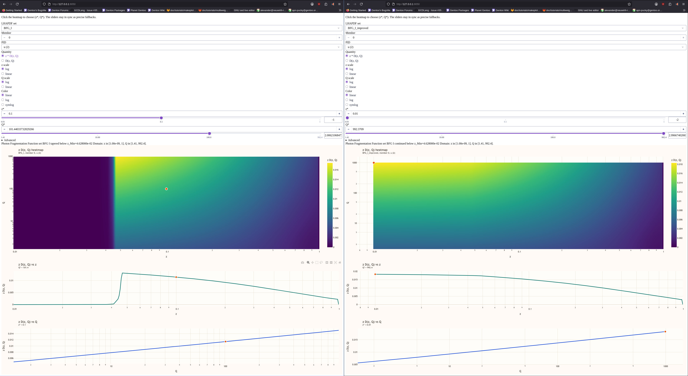

# LHAPDF Utilities

## Explorer



`lhapdf-explorer` is a small Dash app for exploring LHAPDF sets with:

- a large interactive `D(z, Q)` heatmap
- click-to-select `(z*, Q*)` directly from the heatmap
- two equal-width projection plots below the heatmap
- a narrow fixed control column with an Advanced section for technical settings

The UI is tuned toward the workflow you described:

- most-used controls first: set, member, PID, quantity, axis scales, color scale, `z*`, `Q*`
- the heatmap gets most of the space
- sliders act as precise/manual alternatives to clicking the heatmap

### Prerequisites

Install LHAPDF and its Python bindings first. This project expects `import lhapdf` to already work in the Python environment you use to launch the app.

If LHAPDF is installed only at the system level, create the virtual environment with `--system-site-packages` so the existing `lhapdf` module is visible inside the venv.

### Run

```bash
python3 -m venv --system-site-packages .venv
source .venv/bin/activate
pip install -e .
lhapdf-explorer
```

Then open `http://127.0.0.1:8050`.

## Combine Envelope Sets

`lhapdf-combine` builds a three-member envelope set from one or more existing LHAPDF
inputs:

- member 0: average of the input central values
- member 1: upper envelope
- member 2: lower envelope

For the common case, you can point it at a few input sets and let it construct the
gridding information automatically:

```bash
lhapdf-combine BFG_I BFG_II --name BFG_ENV --set-index 999001
```

By default, the CLI computes the common overlap of all input sets, then builds a single
subgrid whose `x` axis is the union of all native input `x` knots in that overlap and
whose `Q` axis is the union of all native input `Q` knots in that overlap. The default
flavor list is the set of flavors shared by all inputs. It installs into the first
writable LHAPDF search path when one is available, otherwise into the current directory.

You can still override the generated single-subgrid definition directly:

```bash
lhapdf-combine BFG_I BFG_II GRV_NLO \
  --name BFG_GRV_ENV \
  --set-index 999001 \
  --description "Average + envelope from BFG I, BFG II, GRV NLO" \
  --authors "Alexander Puck Neuwirth" \
  --reference "arxiv:..." \
  --x-min 0.01 --x-max 1.0 --x-points 50 --x-scale linear \
  --q-min 2.1 --q-max 300.0 --q-points 30 --q-scale log \
  --flavors 21,1,2,3,4,5
```

For more advanced layouts, pass a JSON config file with one or more subgrids:

```json
{
  "name": "BFG_GRV_ENV",
  "set_index": 999001,
  "set_desc": "Average + envelope from BFG I, BFG II, GRV NLO",
  "subgrids": [
    {
      "x_axis": [0.01, 0.03, 0.1, 0.3, 1.0],
      "q_axis": [2.1, 4.0, 10.0, 100.0, 300.0],
      "flavor_axis": [21, 1, 2, 3, 4, 5]
    }
  ]
}
```

```bash
lhapdf-combine BFG_I BFG_II GRV_NLO --config combine.json --install-dir ./pdfsets
```

## Scale Sets

`lhapdf-scale` rescales the grid values of an existing installed LHAPDF set and writes
the result as a new LHAPDF set.

The input syntax follows `SET` or `SET/MEMBER`, so you can scale a whole set or extract
and scale a single member. The output syntax is `NAME` or `NAME@SETINDEX`.

```bash
lhapdf-scale BFG_I BFG_I_x2@999900 --factor 2
lhapdf-scale BFG_I/0 BFG_I_gluon@999901 --factor 1.5 --only 21
lhapdf-scale BFG_GRV_ENV BFG_GRV_ENV_quarks@999902 --factor 0.5 --except 21
lhapdf-scale BFG BFG_only_photons@999902 --factor 1e-9 --except 22
```

By default, the factor is applied to all flavors in all members of the source set. Use
`--only` to target specific PDG IDs or `--except` to leave specific IDs unchanged.

## Notes

- The app uses LHAPDF's `xfxQ(pid, x, Q)` API under the hood. In the UI, the horizontal variable is labeled `z` to match fragmentation-function exploration.
- If your LHAPDF data files live outside the default search paths, set `LHAPDF_DATA_PATH` before launching the app.
